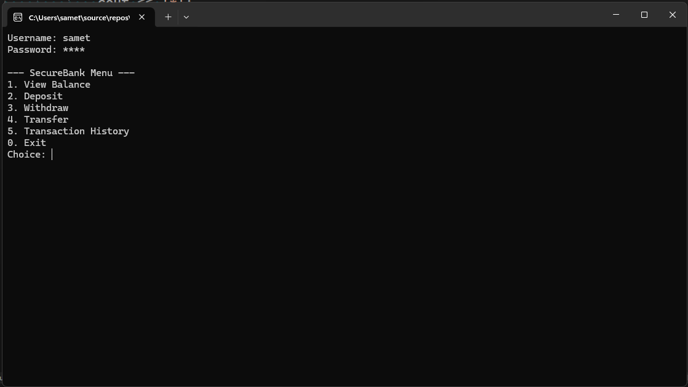
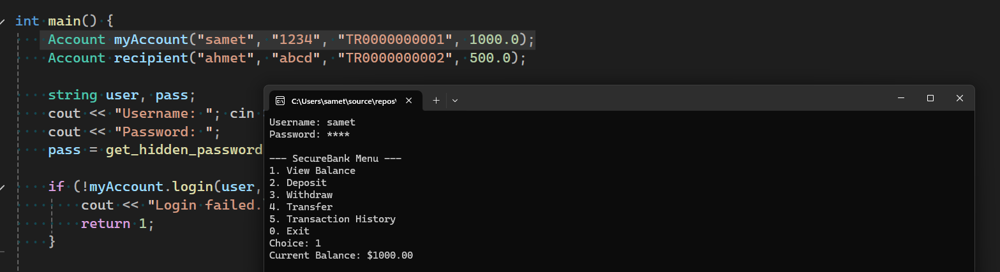
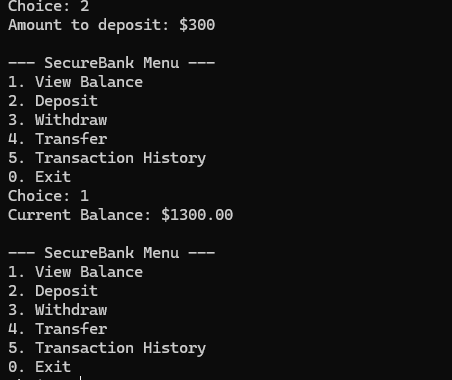
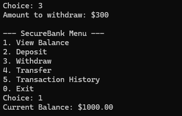
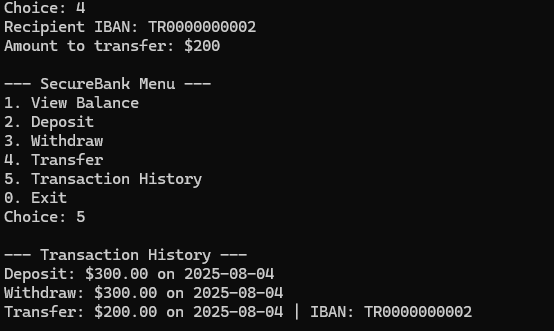

# 💳 SecureBank – Terminal-Based C++ Banking Simulation

SecureBank is a functional banking system written in C++ with a secure and minimal CLI interface. It showcases user login with hidden password input, basic banking operations, and IBAN-based money transfers — ideal for technical internships in fintech or core banking systems.

---

## 🎥 Preview












---

## 🔐 Features

- **Secure Login** with masked password input (using `getch()`)
- **Account Operations**:
  - Balance Inquiry  
  - Deposit / Withdraw  
  - IBAN-based Transfer (with dual-logging)
- **Transaction History Log**  
- **Object-Oriented C++ Architecture**

---

## 🛠 Technologies

- **Language:** C++  
- **Core Concepts:** OOP, Vectors, Terminal UI, File-less simulation  
- **Libraries Used:** `iostream`, `vector`, `iomanip`, `conio.h`

---

## 🧠 Use Cases

This simulation is designed to represent:
- The logic behind banking software in a secure CLI environment.
- How basic account operations, transaction tracking, and identity validation might work behind the scenes.
- Technical proficiency in **algorithmic structuring**, **secure input handling**, and **financial data simulation**.

---

## 📈 Future Development

This project was designed with extensibility in mind. In the future, the core logic of SecureBank can be adapted into a fully interactive web application using **JavaScript**, **HTML**, and **CSS**. This would allow users to interact with the same account and transaction system through a modern browser interface, and potentially connect to a backend using **Node.js** or **Firebase** for persistent storage and multi-user support.

---

## ▶️ How to Run

1. Clone the repository:
   ```bash
   git clone https://github.com/yourusername/SecureBank.git

   Compile the project:

2. Compile the project:
g++ -o securebank src/main.cpp

3. Run:
./securebank


